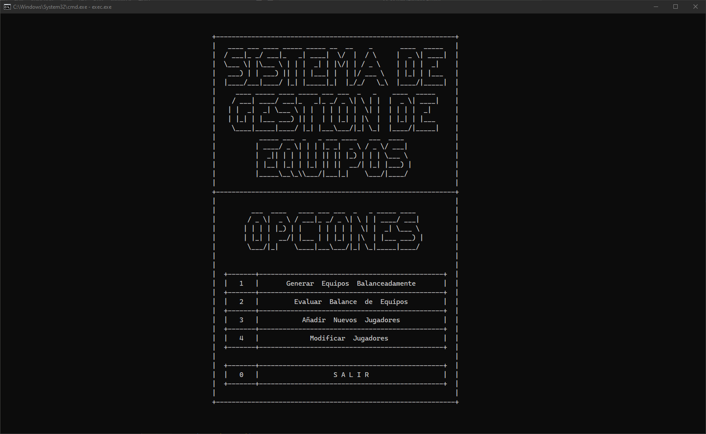
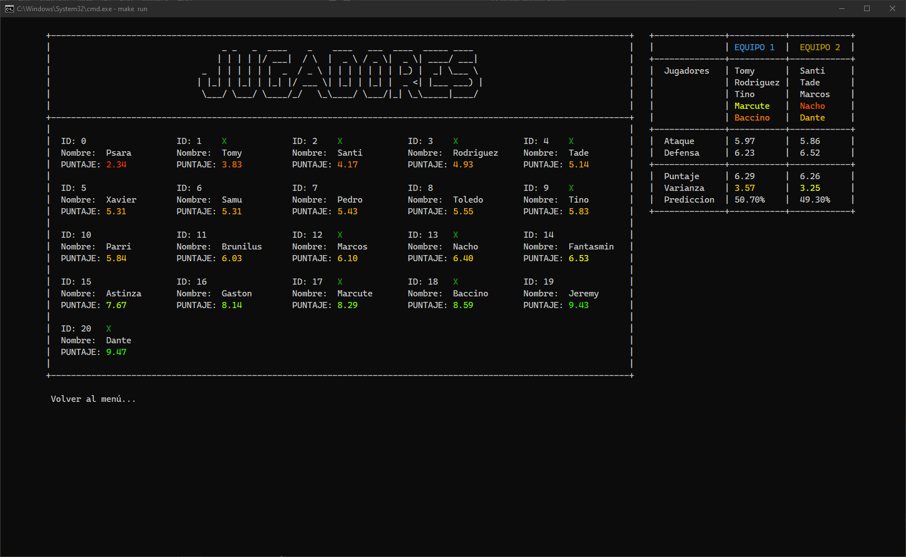
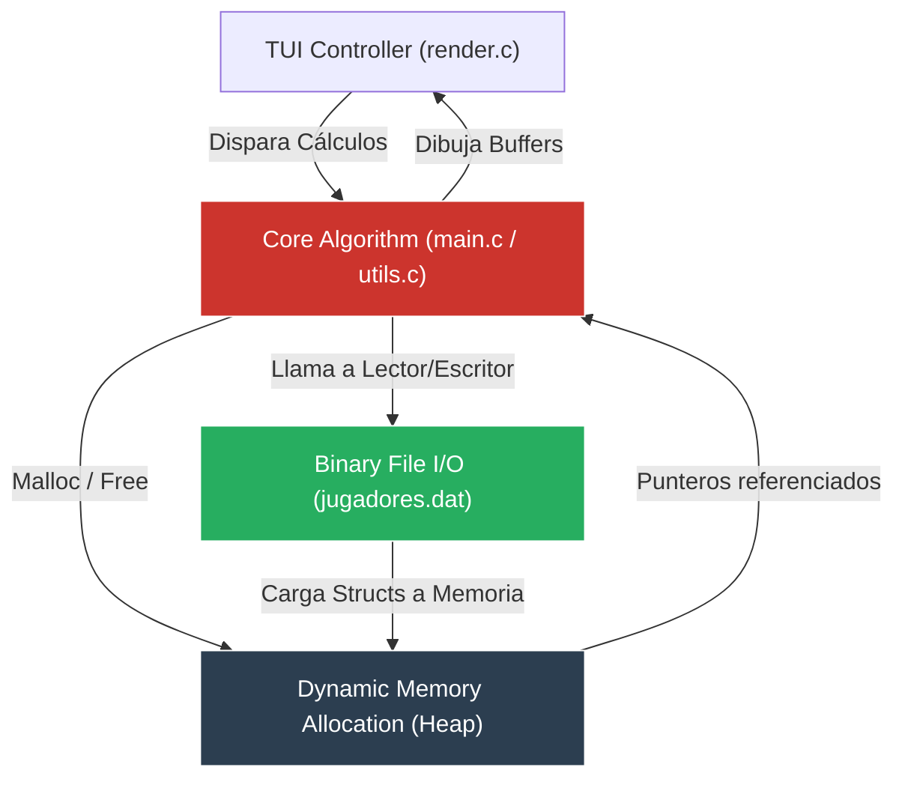

# Motor Algorítmico de Gestión y Balanceo de Equipos (C23)

Sistema CLI avanzado escrito en código nativo para la administración, persistencia binaria y balanceo estadístico de plantillas de fútbol. Utiliza cálculos de varianza y punteros dinámicos para optimizar el emparejamiento de jugadores.


## 📑 Índice
- [El Problema y la Motivación](#problema)
- [Tech Stack y Paradigmas](#tech-stack)
- [Features Clave](#features)
- [Aprendizajes Clave y Roadmap](#aprendizajes)
- [Visuales, Diagramas y Documentación Anexa](#visuales)
- [Instalación y Ejecución Local](#instalacion)

<a name="problema"></a>
## 🧠 El Problema y la Motivación

Balancear dos equipos de fútbol a partir de un listado irregular de jugadores (donde cada uno posee hasta 10 métricas asimétricas como resistencia, velocidad, gambeta y juego en equipo) es inherentemente un problema de cálculo estadístico y optimización combinatoria.

Para lograr una resolución determinística y ultra-rápida, el sistema debía operar directamente a nivel de hardware, sin el sobrepeso de máquinas virtuales. La solución arquitectónica consistió en diseñar una base de datos binaria personalizada en memoria secundaria y un motor lógico en memoria dinámica que distribuye los pesos estadísticos (ataque, defensa, varianza) minimizando la brecha de victoria.

<a name="tech-stack"></a>
## 🏗️ Tech Stack y Paradigmas

*   **Lenguaje y Framework:** Construido en el estándar **C23**, prescindiendo de librerías externas de alto nivel para un control absoluto. Orquestado modularmente a través de `Make`.
*   **Gestión de Memoria (Heap Allocation):** Manejo *Stateful* de plantillas mediante asignación de memoria dinámica a lo largo del ciclo de vida de la aplicación (`malloc` / `free`). Se manipulan estructuras anidadas y punteros de punteros (`**jugadores`) para reasignar entidades dinámicamente sin duplicar su huella en memoria RAM.
*   **Data Layer (Persistencia Binaria):** Motor personalizado para lecto-escritura (*I/O Read/Write*) sobre el archivo `jugadores.dat`. Emplea una estructuración binaria cruda que permite serialización instantánea (*Stateless* inter-sesión) evitando *parsers* costosos.
*   **Capa de Presentación:** Módulo *Text User Interface* (TUI) customizado para renderizado en buffer de terminal, con manejo de cursores y *hooks* de teclado no bloqueantes.

<a name="features"></a>
## ⚡ Features Clave

*   **Algoritmo de Balanceo Competitivo:** Cruza las estadísticas ofensivas y defensivas individuales, calculando promedios y varianzas grupales. Genera matemáticamente las dos escuadras probabilísticamente más parejas.
*   **Control Fino de Punteros:** La matriz de selección asigna referencias en memoria sin copiar la data de los jugadores. Esto previene fugas de memoria (*Memory Leaks*) y mantiene la huella de ejecución en el orden de los kilobytes.
*   **Abstracción Modular C23:** El código está fuertemente desacoplado mediante cabeceras (*Headers*). La lógica de renderizado gráfico (`render.c`) no conoce la implementación de los manejadores de archivo (`files.c`), imitando inyecciones de dependencias primitivas.

<a name="aprendizajes"></a>
## 📈 Aprendizajes Clave y Roadmap

*   **Dangling Pointers y Fugas de Memoria:** Diseñar el flujo de creación y destrucción de los equipos requirió extrema disciplina para liberar las estructuras anidadas (`free(equipo1.jugadores)`) antes del final de ciclo principal (`while`).
*   **Serialización a Bajo Nivel:** Mapear *structs* directamente a bloques de bytes es exponencialmente más veloz que usar archivos de texto delimitados, pero demostró la criticidad de mantener las definiciones del `struct` inmutables frente al disco, o enfrentarse a corrupciones de lectura.

<a name="visuales"></a>
## 🖼️ Visuales, Diagramas y Documentación Anexa

<div align="center">
  <h4>Interfaz Gráfica de Consola (TUI)</h4>
  
  
</div>

### Arquitectura Lógica de Memoria y Flujo Binario



<a name="instalacion"></a>
## ⚙️ Instalación y Ejecución Local

Este proyecto puede compilarse nativamente utilizando `make` y el compilador `gcc`.

### Pre-requisitos
*   Entorno de terminal compatible con **GCC** o **MinGW** (Windows).
*   **Make** instalado.

### Comandos de Compilación

1. Clonar el repositorio.
   ```bash
   git clone https://github.com/tsorren/Sistema-de-Gestion-Equipos-de-Futbol.git
   cd Sistema-de-Gestion-Equipos-de-Futbol
   ```
2. Compilar el código (Automáticamente enlazará los objetos `.o` y creará el ejecutable `exec.exe`).
   ```bash
   make
   ```
3. Ejecutar el sistema.
   ```bash
   make run
   ```
4. Limpiar objetos y binarios generados.
   ```bash
   make clean
   ```